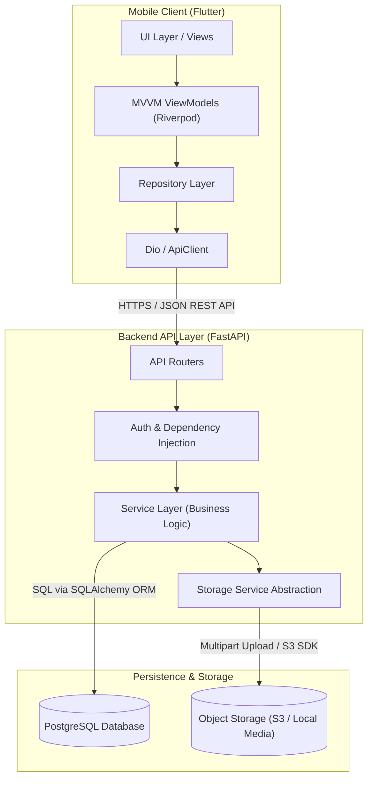

# VibeReel System Architecture

## 🏛️ Architecture Overview

**VibeReel** is built as a clean, decoupled full-stack architecture. The system consists of a cross-platform mobile client (**Flutter for iOS & Android**) communicating with a high-performance RESTful API service (**FastAPI in Python**), backed by a relational database (**PostgreSQL**) and an **S3-compatible Object Storage Service**.

---

## 📐 System Architecture Diagram

```text
+-----------------------------------------------------------------------+
|                         Mobile Client Layer                           |
|                      (Flutter - iOS & Android)                        |
|                                                                       |
|  +------------------+    +-------------------+    +----------------+  |
|  |  UI Views &      | -> | Riverpod State    | -> | Repository /   |  |
|  |  Widgets         |    | Management (MVVM) |    | ApiClient      |  |
|  +------------------+    +-------------------+    +----------------+  |
+-----------------------------------:-----------------------------------+
                                    | HTTPS / JSON
                                    v
+-----------------------------------------------------------------------+
|                         Backend API Layer                             |
|                        (FastAPI & Python 3)                           |
|                                                                       |
|  +------------------+    +-------------------+    +----------------+  |
|  |  Routers / API   | -> | Service Layer     | -> | Repositories & |  |
|  |  Endpoints        |    | (Business Logic)  |    | Data Models    |  |
|  +------------------+    +-------------------+    +----------------+  |
+-------------------:-----------------------------------:---------------+
                    | SQL (SQLAlchemy ORM)              | S3 API / Direct IO
                    v                                   v
+---------------------------------------+   +---------------------------+
|           Database Layer              |   |   Object Storage Layer    |
|            (PostgreSQL)               |   |   (S3 / Cloud Storage)    |
|                                       |   |                           |
| - Users, Profiles, Auth Tokens        |   | - Transcoded MP4 Videos   |
| - Video Metadata & Hashes             |   | - JPEG / PNG Thumbnails   |
| - Likes, Comments, Saves, Follows     |   | - Profile Avatars         |
| - Forum Posts, Comments & Moderation  |   +---------------------------+
| - Notifications & Audit Logs          |
+---------------------------------------+
```



---

## 🔄 Core Data Flow Specifications

### 1. Mobile → API → Database Flow
Used for metadata, user authentication, social interactions (likes, comments, follows, saves), search, notification delivery, and creator forum management.

```text
[Flutter Client] 
   │ 
   ├── 1. Sends HTTP Request with Bearer JWT Header
   ▼
[FastAPI Router]
   │ 
   ├── 2. Auth Dependency verifies JWT signature & fetches active user
   ├── 3. Validates request body against Pydantic schema
   ▼
[Service & Repository Layer]
   │ 
   ├── 4. Executes business logic (rate limits, block filters, notifications)
   ├── 5. Queries PostgreSQL via SQLAlchemy ORM (with composite indexes)
   ▼
[PostgreSQL Database]
   │ 
   ├── 6. Executes indexed SQL query & commits transaction
   ▼
[FastAPI Response]
   │ 
   ├── 7. Serializes ORM model into Pydantic DTO Response JSON
   ▼
[Flutter State]
   └── 8. Riverpod ViewModel receives data and updates UI reactive state
```

### 2. Mobile → API → Video Storage Flow
Used for video recording, gallery selection, thumbnail extraction, and publishing short video content.

```text
[Flutter Client]
   │
   ├── 1. Selects / records MP4 video & generates JPEG thumbnail
   ├── 2. Sends Multipart HTTP POST (`/api/v1/videos/upload-file`)
   ▼
[FastAPI Storage Router]
   │
   ├── 3. Validates file extension (.mp4, .mov) and size limit (<= 100MB)
   ├── 4. Sanitizes filename & generates unguessable UUID storage key
   ▼
[Storage Service Abstraction]
   │
   ├── 5. Writes bytes to S3 Object Storage bucket or Local Media storage
   ├── 6. Obtains public CDN / HTTPS media storage URL
   ▼
[PostgreSQL Database]
   │
   ├── 7. Saves video record with user_id, caption, storage URL, thumbnail URL
   ▼
[FastAPI Response]
   └── 8. Returns completed VideoResponse DTO to Mobile Client
```

---

## 🛡️ Security Architecture

1. **Authentication & Authorization**:
   - Stateless JWT access tokens signed with `HS256`.
   - Refresh token rotation strategy stored in database.
   - Ownership verification on resource updates/deletions.
2. **Input Validation & Throttling**:
   - Pydantic v2 schemas for rigid typing and bounds checking.
   - IP-based rate limiting on sensitive routes (`/auth/register`, `/auth/login`, `/moderation/reports`).
3. **Storage Security**:
   - Backend holds S3 storage credentials; mobile app receives only CDN URLs.
   - File extension and MIME type validation before saving files.

---

## ⚡ Performance & Scalability Architecture

- **PostgreSQL Composite Indexes**: Tailored indexes on `(is_draft, created_at)`, `(category, created_at)`, `(blocker_id, blocked_id)`, and `(recipient_id, is_read)` guarantee low-latency query performance.
- **Async & Non-blocking Design**: FastAPI handles concurrent network IO efficiently using ASGI (`uvicorn`).
- **Reactive Flutter State**: Riverpod `StateNotifier` ensures minimal widget rebuilds during full-screen vertical video scrolling.
